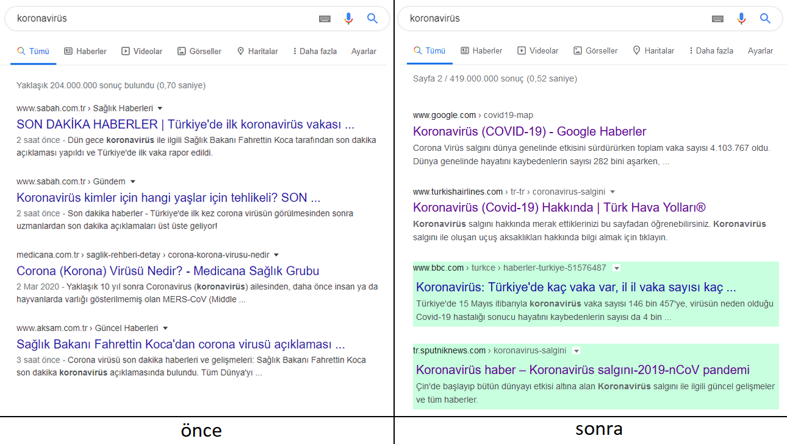

# TemizAramaMotorum (önceki TemizGoogle)

[](#)
[](#)
[](#)
[](#)
[](#)
[](#)
[](#)
[](#)
[](#)
[](#)
[](#)
[](#)
[](#)
[](https://twitter.com/HuzunluArtemis)
[](https://t.me/HuzunluArtemis)
[](https://huzunluartemis.github.io/)

## TemizAramaMotorum

🇹🇷 Çöp haber sitelerinden ve sahteci sitelerden arınmış tertemiz bir arama motoru deneyimi

🇬🇧 A clean search engine experience free from stupid news sites and fake sites

[](https://huzunluartemis.github.io/)

## Features / Özellikler
<details>
  <summary><b>🇬🇧 Click Here 🇹🇷 Buraya Tıkla</b></summary><br>

- Çoğunlukla Türk siteleri için çalışır. Çöplüğe dönmüş googledan bilgi almak neredeyse imkansız hale geldi.
- Haber siteleri spam içerikle dolup taşmış durumda.
- Şu an en iyi çözüm arama motorunuzu değiştirmek olacaktır. Önerebileceklerim:
    - 1. [DuckDuckGo](https://duckduckgo.com/) (bizzat kullanıyorum. bir şans verin.)
    - 2. [Yandex](https://yandex.com.tr/)
- Bu arama motorları en azından 5 spam haberden 1 tanesini gösteriyor. Google'a göre iyidir.
Ayrıca belirtmek isterim ki duckduckgo, google gibi [verilerinizi toplamıyor](https://eksisozluk.com/duckduckgo--2441246?a=nice).
- Bu kuracağınız eklenti Google, Bing DuckDuckGo, Ecosia ve Startpage için çalışır. Kendi listelerinizi oluşturabilirsiniz. Fotoğrafta da görebileceğiniz gibi yeşil ya da mavi olan renkler önerilen sitelerdir. Zararsız oldukları listeyi oluşturanlar tarafından belirlenmiştir. [TurkishAdblockList](https://github.com/huzunluArtemis/turkishAdblockList/) ile birlikte kullanınız.
- Eğer daha da güçlü bir filtre kullanmak isterseniz şuna göz atabilirsiniz: [ublacklist-tr](https://github.com/dr-norton/ublacklist-tr) (Önermem. Ne var ne yok temizliyor.)
</details>
  
## Kurulum / Install
<details>
  <summary><b>🇬🇧 Click Here 🇹🇷 Buraya Tıkla</b></summary><br>

- öncelikle tarayıcınıza uygun olanı kurun: [chrome, opera, yeni edge](https://chrome.google.com/webstore/detail/ublacklist/pncfbmialoiaghdehhbnbhkkgmjanfhe) | [firefox](https://addons.mozilla.org/tr/firefox/addon/ublacklist/) | [Mac App-Store](https://apps.apple.com/us/app/ublacklist-for-safari/id1547912640)
- eklentiyi kurduktan sonra eklentiye tıklayıp options kısmına girin.
- en aşağıda Subscription kısmında Add Subscription'a tıklayın: [(1)](./img/help.png)
- Name kısmına ha yazın: [(2)](./img/help.png)
- URL kısmına aşağıdaki url'yi kopyalayın: [(3)](./img/help.png)

```
https://raw.githubusercontent.com/HuzunluArtemis/TemizAramaMotorum/main/src/TemizAramaMotorum.txt
```
</details>

## Site Bildir / Report Site
<details>
  <summary><b>🇬🇧 Click Here 🇹🇷 Buraya Tıkla</b></summary><br>

- engellenmesini uygun gördüğünüz siteleri, veya çıkarılması gereken bilgi kaynaklarını bildirin, listeye ekleyelim veya listeden çıkaralım ki diğer insanlar bunlarla uğraşmasınlar, vakit kaybetmesinler. [hatalar](https://github.com/HuzunluArtemis/TemizAramaMotorum/issues) kısmından bildirebilirsiniz.
</details>


## Esin kaynakları / Sources of Inspiration
<details>
  <summary><b>🇬🇧 Click Here 🇹🇷 Buraya Tıkla</b></summary><br>

- [xorcan](https://github.com/xorcan)
- [ublacklist-tr](https://github.com/dr-norton/ublacklist-tr)
- [journo.com.tr](https://journo.com.tr/google-aramalar-dijital-reklam)
- ekşi sözlük [1](https://eksisozluk.com/haber-sitelerinin-googlei-copluge-cevirmesi--5730208?a=nice) [2](https://eksisozluk.com/entry/107293018) [3](https://eksisozluk.com/entry/107354288) [4](https://eksisozluk.com/entry/106376984) [5](https://eksisozluk.com/entry/106310384) [6](https://eksisozluk.com/entry/63680993) [7](https://eksisozluk.com/entry/106320055) [8](https://eksisozluk.com/entry/107298920)
- [sosyalmeyda.co](https://sosyalmedya.co/google-haberler-spam-icerikler/)
- [tebilisim.com](https://www.tebilisim.com/daha-iyi-bir-haber-sitesi-icin-neler-yapilmali/)
- [ccn.com](https://www.ccn.com/ccn-is-shutting-down-after-googles-june-2019-core-update/)
- [limonhaber](https://twitter.com/LimonHaber), [nayn.org](https://nayn.org/search/)
- [makeuseof.com](https://www.makeuseof.com/tag/customize-google-search-results/)
</details>

## Lisans / License
<details>
    <summary><b>🇬🇧 Click Here 🇹🇷 Buraya Tıkla</b></summary>
  <br>
  <a href="https://www.gnu.org/licenses/gpl-3.0.en.html">
  
</a>
<br>
<br>
TemizAramaMotorum is Free Software: You can use, study share and improve it at your
will. Specifically you can redistribute and/or modify it under the terms of the 
  <a href="https://www.gnu.org/licenses/gpl.html">GNU General Public License</a> 
  as published by the Free Software Foundation, either version 3 of the License, 
  or (at your option) any later version.
</details>
